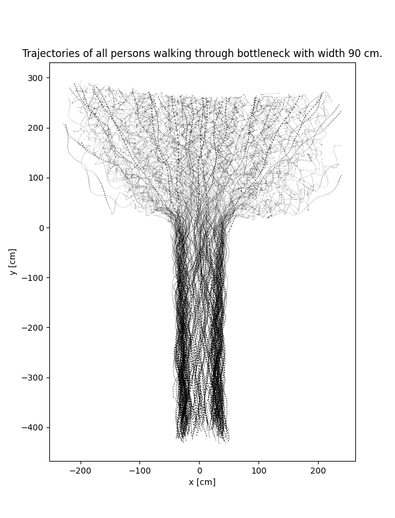
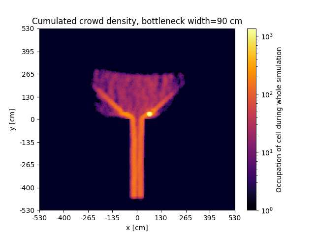
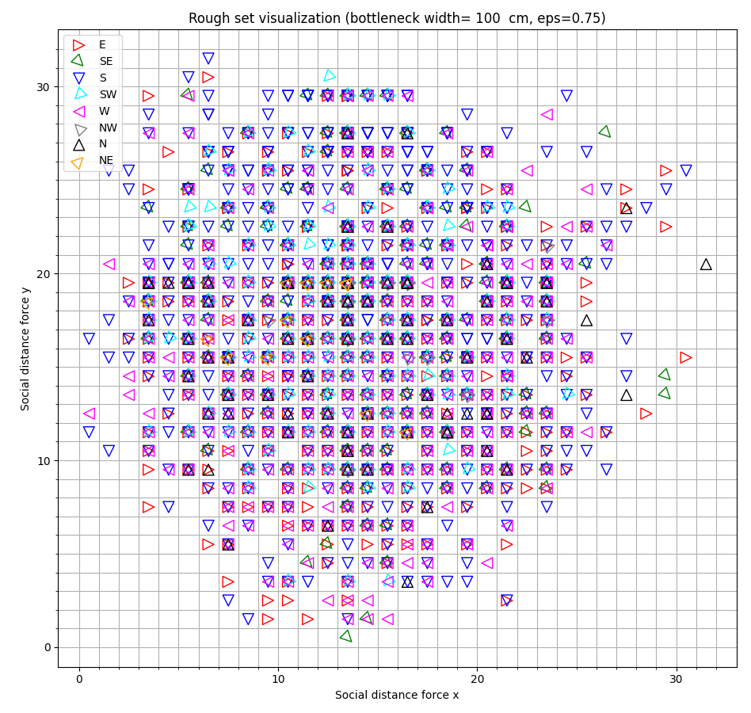

### Source codes for paper:

# An insightful data-driven crowd simulation model based on rough sets 

Author: [Tomasz Hachaj](https://home.agh.edu.pl/~thachaj/) [Jarosław Wąs](https://home.agh.edu.pl/~jarek/)

Abstract:

Data-driven crowd simulation with insightful principles is an open, real-world, and challenging task. The issues involved in modeling crowd movement so that agents' decision-making processes can be interpreted provide opportunities to learn about the mechanisms of crowd formation and dispersion and how groups cope with overcoming obstacles. In this article, we propose a novel agent-based simulation algorithm to infer practical knowledge of a problem from the real world by modeling the domain knowledge available to an agent using rough sets. As far as we know, the method proposed in our work is the first approach that integrates a well-established agent-based simulation model of social forces, an insightful knowledge representation using rough sets, and Bayes probability inference that models the stochastic nature of motion. Our approach has been tested on real datasets representing crowds traversing bottlenecks of varying widths. We also conducted a test on numerous artificial datasets involving 1,000 agents. We obtained satisfactory results that confirm the effectiveness of the proposed method. The dataset and source codes are available for download so our experiments can be reproduced.
-->
Keywords: Rough sets; Crowd simulation; Agent system; Insightful model; Social forces; Bottleneck problem

## Requirements

- Python 3.X
- numba >= 0.56, 
- numpy >= 1.23
- opencv-python >= 4.7
- R language >= 3.6.2 

Tested on: 
- PC, Intel i7-9700 3GHz, 64 GB RAM, NVIDIA GeForce RTX 2060 GPU, Windows 10 OS,
- Laptop, Intel i7-11800H 2.3GHz, 32 GB RAM, NVIDIA GeForce RTX 3050 Ti Laptop GPU, Windows 11 OS.

## How to run

Run scripts in the following order:
1. Generate input data [data_reader_calculate_forces.py](data_reader_calculate_forces.py)
2. Further, process the input data [generate_input_data.R](generate_input_data.R)
3. Generate rough sets (this will create large files) [generate_rough_sets.py](generate_rough_sets.py)
4. Social forces simulation 1,000 agents [simulation_social_forces_loop_all.py](simulation_social_forces_loop_all.py)
5. Social forces simulation, data from file [simulate_social_forces_from_file.py](simulate_social_forces_from_file.py)
6. Rough sets simulation, data from file [simulation_rough_set_from_file.py](simulation_rough_set_from_file.py)
7. Simulation rough set, 1,000 agents [simulation_rough_set_loop_all.py](simulation_rough_set_loop_all.py)
8. Generate reference data from csv [generate_reference_data.py](generate_reference_data.py)
9. Generate a table that presents the dependency of attributes D from a set of attributes C [tables/Dependency_C_D_tables.py](tables/Dependency_C_D_tables.py)
10. Generate a table that presents values of the accuracy of the approximation, etc. [tables/eval_tables.py](tables/eval_tables.py)
11. Generate a table that presents the results of the logarithm of cumulated crowd density comparison between actual data and results obtained by the social forces algorithm and rough set-based algorithm [tables/MSE_tables.py](tables/MSE_tables.py)

Additional scripts:
- Plot input data to screen or file [show_input_data.py](show_input_data.py)
- Plot rough set [sets_plots/plot_set_social.py](sets_plots/plot_set_social.py)
- Plot trajectories of all persons walking through a bottleneck [sets_plots/plot_example_trajectories.py](sets_plots/plot_example_trajectories.py) 
## Example result plots

Reference data

Trajectories of all persons walking through a bottleneck

The logarithm of the cumulated crowd density is defined as the total number of iterations of simulation when an agent occupies a certain cell in the simulation grid.

This figure visualizes the rough set generated from a dataset with a bottleneck width equal to 100 cm with conditional attributes C7.

## Data source

Data downloaded from the archive of experimental data from studies about pedestrian dynamics [link](https://ped.fz-juelich.de/database/doku.php)

## Full text

[https://www.sciencedirect.com/science/article/abs/pii/S0020025524015846](https://www.sciencedirect.com/science/article/abs/pii/S0020025524015846)

##Cite as

Tomasz Hachaj, Jarosław Wąs, An insightful data-driven crowd simulation model based on rough sets, Information Sciences, Volume 692, 2025, 121670, ISSN 0020-0255, https://doi.org/10.1016/j.ins.2024.121670

Bibtex:

@article{HACHAJ2025121670,\
title = {An insightful data-driven crowd simulation model based on rough sets},\
journal = {Information Sciences},\
volume = {692},\
pages = {121670},\
year = {2025},\
issn = {0020-0255},\
doi = {https://doi.org/10.1016/j.ins.2024.121670}, \
url = {https://www.sciencedirect.com/science/article/pii/S0020025524015846} \
}
